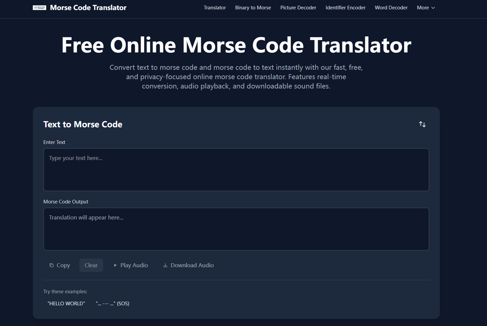

## Morse Code Translator

An all-in-one Morse code learning hub built with Next.js 15 (App Router + Turbopack). The site delivers a real-time text ↔ Morse translator, companion encoding utilities, and a content-rich blog for educators, radio operators, and history fans.

### Preview


### Features
- **Live Translator:** Bi-directional text/Morse conversion with audio playback, timing controls, download options, and practice helpers.
- **Utility Suite:** Dedicated tools for binary, hexadecimal, picture decoding, and other code systems (`app/utils`).
- **Editorial Blog:** Curated long-form articles with locally hosted illustrations for reliable rendering (`lib/blog/articles.ts` + `public/blog`).
- **Responsive UI:** Tailwind CSS (v4) driven components, light/dark themes, sticky navigation, and accessibility-focused interactions.
- **SEO Ready:** Comprehensive metadata, JSON-LD schema, canonical tags, and share cards baked into each route.

### Tech Stack
- [Next.js 15](https://nextjs.org/) with the App Router and Turbopack builds
- React 19 with the experimental Server Components defaults
- Tailwind CSS 4 (pre-release) via the new `@import "tailwindcss";` entrypoint
- TypeScript with strict mode

### Local Development
1. Install dependencies:
   ```bash
   npm install
   ```
2. Run the dev server:
   ```bash
   npm run dev
   ```
   The app will be available at [http://localhost:3000](http://localhost:3000).
3. Build & preview production output:
   ```bash
   npm run build
   npm run start
   ```

### Content & Assets
- Blog articles live in `lib/blog/articles.ts`. Each entry includes front-matter, HTML content, and paths to local media.
- Blog illustrations are stored under `public/blog/<slug>/`. Use SVG or optimized images to avoid external hotlink issues.
- Shared UI components reside in `app/components/`. Utility functions are under `app/utils/`.

### Testing & QA
- `npm run build` validates type safety and route generation.
- Add integration or e2e tests as needed (not included by default).

### Deployment
Deploy to any Node.js hosting provider. For Vercel:
```bash
npm run build
```
then connect the repository to Vercel and push `main`.

### Contributing
1. Create a feature branch from `main`.
2. Make your changes and ensure `npm run build` succeeds.
3. Submit a PR with a concise summary and testing notes.
